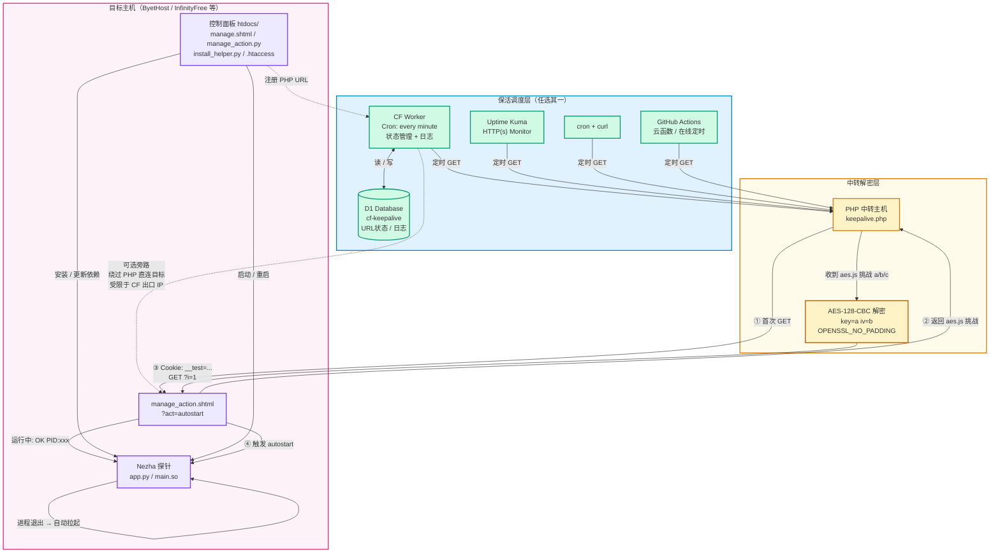
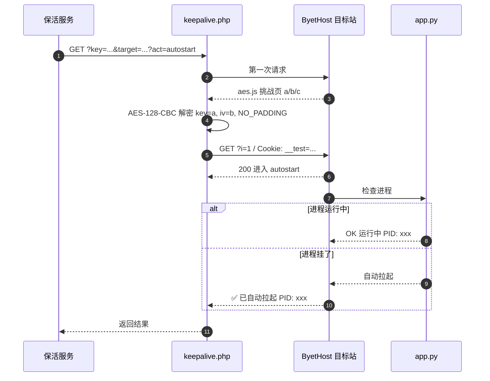

# 扎针面板 + URL 保活监控

一套部署在免费虚拟主机上的 Nezha 探针管理面板 + URL 保活方案。配合**任意定时访问服务**检查目标 URL，自动处理 ByetHost 等主机的 `aes.js` 挑战。

# ⭐ **觉得有用？给个 Star 支持一下！**

```
.
├── htdocs/                      # 虚拟主机面板
│   ├── .htaccess                # SSI 配置
│   ├── install_helper.py        # 环境初始化
│   ├── manage.shtml             # 面板 UI
│   ├── manage_action.py         # 后端逻辑
│   └── manage_action.shtml      # SSI 入口
├── Keepalive/                   # 保活系统
│   ├── _worker.js               # CF Worker（含挑战处理）
│   ├── wrangler.toml            # CF Worker 配置
│   └── keepalive.php            # PHP 中转（含挑战处理）
└── README.md
```

---

## 架构总览



**两条原则：**

1. **保活服务是什么都行**——CF Worker、Uptime Kuma、cron+curl、GitHub Actions、云函数，只要能定时 GET 一个 URL。
2. **PHP 中转必需**——它负责处理 byethost 的 `aes.js` 挑战。保活服务本身不做挑战处理，直连 byethost 会被挡。

> **为什么不直连？** Cloudflare 出口是共享 IP，容易被 byethost 识别为爬虫限流（`429`）。换用独立 IP 的 PHP 主机（alwaysdata / CT8 / SERV00 等）更干净。

---

## 一、虚拟主机面板部署（htdocs/）

支持 SSI + Python 的虚拟主机：[HyperPHP](https://hyperphp.com/)、[Byet.Host](https://byet.host/)、[InfinityFree](https://www.infinityfree.com/)、[ProFreeHost](https://profreehost.com/)

**步骤：**

1. 把 `htdocs/` 下 5 个文件上传到主机的 `htdocs/` 或 `public_html/`
2. 访问 `https://你的域名/manage.shtml`
3. 首次访问设置管理密码
4. 填写 Nezha 探针配置 → 点「安装/更新依赖」→ 点「▶ 启动/重启」

---

## 二、PHP 中转部署（必需）

### 1. 修改配置

编辑 `keepalive.php` 顶部：

```php
$SECRET  = 'admin123';   // ← 改成你自己的随机密钥
$TIMEOUT = 15;
```

### 2. 上传

把 `Keepalive/keepalive.php` 上传到任意 PHP 主机的 `~/www/`（CT8、SERV00、alwaysdata 等）。

> 若用 alwaysdata，在管理面板 → **Advanced → PHP** 里启用 `curl` 和 `openssl` 扩展。

### 3. 测试

```
https://你的PHP主机/keepalive.php?key=admin123&target=http://abc.byethost5.com/manage_action.shtml?act=autostart
```

期望输出：

```
OK http://abc.byethost5.com/manage_action.shtml?act=autostart [200] (challenge)
✅ 已自动拉起 PID: 29752
```

**这条 URL 就是接下来要注册到保活服务的地址。**

---

## 三、保活服务配置（任选其一）

保活服务只需做一件事：**定时对第二章生成的 PHP URL 发 GET**。

### 方案 1：本项目 CF Worker

**部署步骤：**

1. Cloudflare Dashboard → **Workers & Pages** → **Create application** → **Create Worker** → **Deploy**
2. **Workers & Pages** → **D1** → **Create database**，名称 `cf-keepalive`
3. Worker 详情页 → **Settings** → **Variables and Secrets**：
   - **D1 Database Bindings** → 添加 `DB` → 选 `cf-keepalive`
   - **Environment Variables** → 添加 **Secret** `ADMIN_PASSWORD` = 你的密码
4. Worker 详情页 → **Edit code**，粘贴 `Keepalive/_worker.js` → **Save and Deploy**
5. **Settings** → **Triggers** → **Cron Triggers** → 填 `* * * * *`
6. **Settings** → **Domains & Routes** → **Custom Domain** 绑定子域名（如 `keep.yourdomain.com`）

> ⚠️ `workers.dev` 域名在部分网络环境无法访问，**必须绑定自定义域名**。

**注册保活 URL：** 打开面板登录，在「添加 URL」里填入第二章生成的 PHP URL。

**验证：**

```bash
curl -X POST "https://keep.yourdomain.com/add-url" \
  -H "Content-Type: application/json" \
  -d '{"url":"http://abc.byethost5.com/manage_action.shtml?act=autostart"}'
```

返回 `{"success": true}` 即成功。

### 方案 2：Uptime Kuma

新建 Monitor → **Type**: `HTTP(s)` → **URL**: 第二章的 PHP URL → **Heartbeat Interval**: `600`

### 方案 3：cron + curl

```cron
*/10 * * * * curl -s "https://你的PHP主机/keepalive.php?key=admin123&target=http://abc.byethost5.com/manage_action.shtml?act=autostart" > /dev/null 2>&1
```

**多目标：** 每个目标注册一条独立 URL，各自调度。

---

## 四、状态管理与 API（仅 CF Worker 面板）

| 状态 | 触发条件 | 恢复方式 |
|------|---------|---------|
| 正常 | 上次检查成功 | — |
| 失败 N | 检查失败 < 5 次 | 下次成功自动清零 |
| **自动禁用** | 连续失败 5 次 | **30 分钟后自动重试**，成功即恢复 |
| **手动禁用** | 用户主动点「禁用」 | 需手动点「启用」，**永不自动恢复** |
| 未检查 | 刚添加 | 首次检查后更新 |

**操作按钮：**

- **检查**：立即访问一次，跳过 interval 限制。成功则解除禁用。
- **启用/禁用**：手动控制自动检查开关。
- **删除**：从列表移除。

**API 接口：**

| 方法 | 路径 | 认证 | 说明 |
|------|------|------|------|
| POST | `/add-url` | ❌ | 公开添加 URL |
| GET | `/api/state` | ✅ | URL 列表 + 日志 |
| POST | `/api/add` `/api/delete` `/api/toggle` `/api/check` `/api/check-one` | ✅ | 管理操作 |
| DELETE | `/api/logs` | ✅ | 清空日志 |

认证：请求头 `X-Auth-Token: <你的密码>`

---

## 五、保活原理


---

## 六、常见问题

**Q: 保活服务一定要 CF Worker 吗？**
不用。任何能定时发 HTTP GET 的服务都行——Uptime Kuma、cron+curl、GitHub Actions、在线定时服务、云函数都行。

**Q: 为什么需要 PHP 中转？**
byethost 有 `aes.js` 挑战，保活服务不做挑战处理，直连会被挡。PHP 中转负责解挑战后转发。

**Q: CF Worker 不能直连 byethost？**
能，但 CF 出口共享 IP 容易被限流（`429`）。PHP 主机独立 IP 更干净。

**Q: URL 被自动禁用了？**
等 30 分钟自动重试，或手动点「检查」。成功后自动恢复。仅 CF Worker 面板有此机制。

**Q: 手动禁用后会自动恢复吗？**
不会。必须手动点「启用」。

**Q: `workers.dev` 为什么访问不了？**
部分网络环境屏蔽。必须绑定自定义域名。

**Q: 没有域名？**
Cloudflare 提供免费域名注册（`.cf` 等后缀），或把已有域名 NS 托管到 Cloudflare。

**Q: 挑战解密失败？**
- PHP：`php -m | grep openssl` 确认扩展已启用
- CF Worker：Compatibility date 设为 `2024-09-23` 或更晚

**Q: `Call to undefined function curl_init()`？**
alwaysdata 面板 → **Advanced → PHP** 启用 `curl` 和 `openssl`。

**Q: 怎么改密码？**
- 面板：编辑 `manage_action.py` 顶部 `ACCESS_PASSWORD`
- Worker：Dashboard → Settings → Variables and Secrets → `ADMIN_PASSWORD`
- PHP：编辑 `keepalive.php` 顶部 `$SECRET`

**Q: `env.DB` 是 undefined？**
D1 绑定的 Variable name 必须是 `DB`（大小写敏感）。

**Q: Cron 没触发？**
确认 **Triggers** 里 Cron 是 `* * * * *` 且 Worker 已 Deploy。可在 **Logs** 查看 `scheduled` 事件。

**Q: 免费额度够用吗？**
CF Workers 每天 10 万请求（Cron 每分钟 = 1440/天），alwaysdata 100 MB 磁盘。10 条 URL 以内绰绰有余。

---

**⚠️ 免责声明**：本脚本仅供学习与自动化运维研究，使用者须遵守
[HyperPHP](https://hyperphp.com/)、[Byet.Host](https://byet.host/)、[InfinityFree](https://www.infinityfree.com/)、[ProFreeHost](https://profreehost.com/) 的服务条款。因使用本脚本导致的账号限制或其他问题，作者不承担任何责任。
